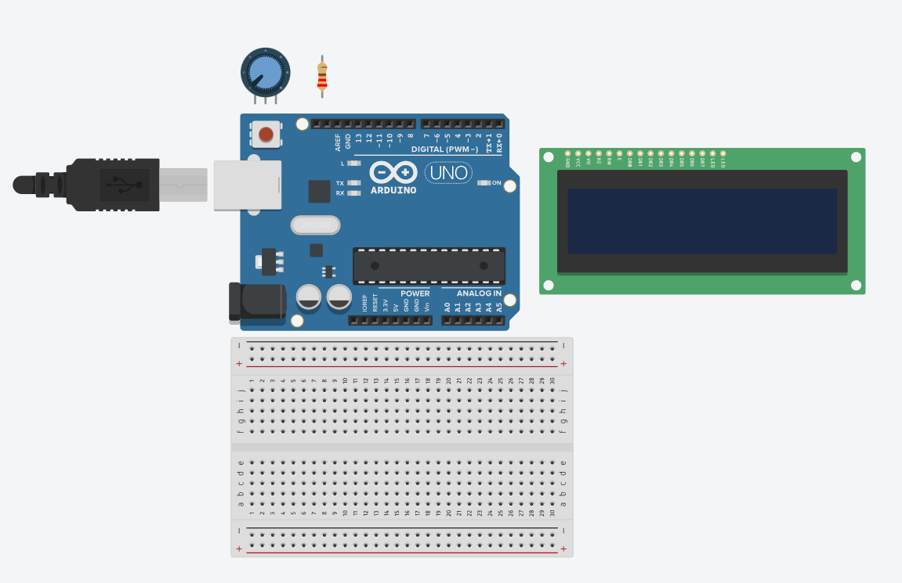
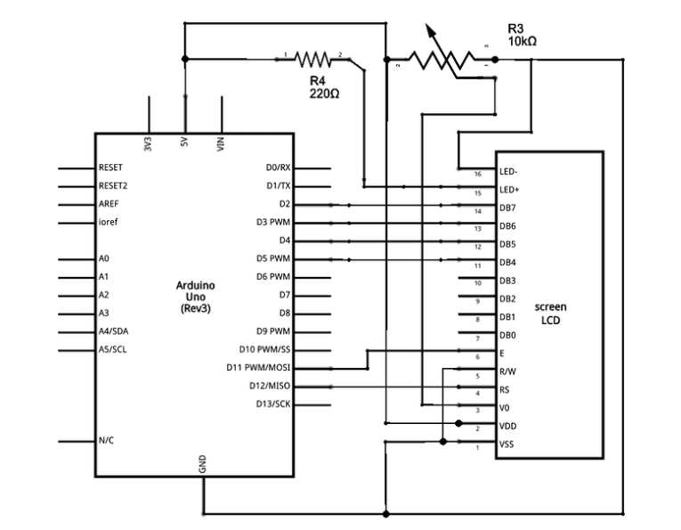
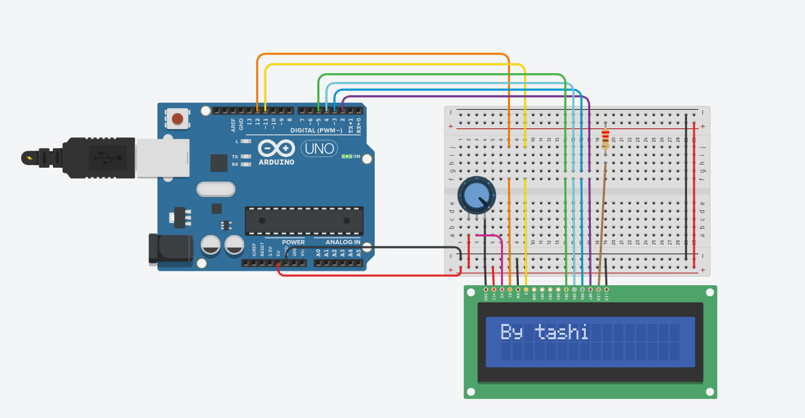
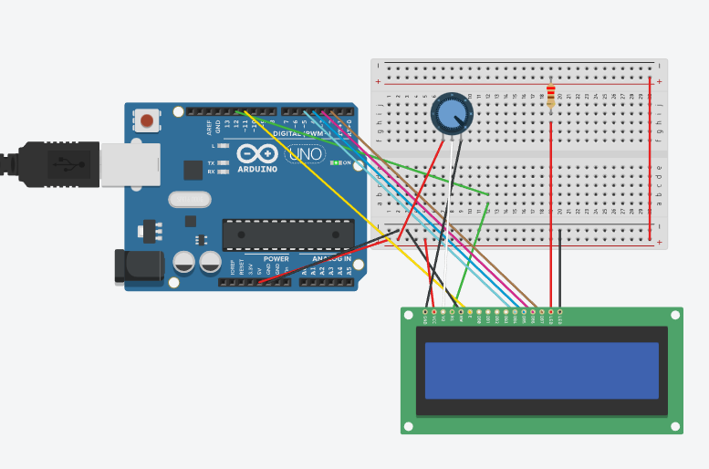

# Instructions
- following the:
http://www.arduino.cc/en/TutorialLiquidCrystal

## HARDWARE Required

#

- Arduino board 

(I use arduino UNO r3 on tinkercad)
#
- LCD Screen
(I use a 16x2). 
#
- Pin headers to solder to the LCD display pins

(or just made it on tinkercad :P)
#
- 10km OHM potentiometer

 more about potentiometers: 
  https://youtu.be/sWbSeJmUFfw
#
- 220 ohm resistor
#
- hook-up wires   

(if you're doing this using a breabord or out of a simulated space)
#
- breadbord
#

## How to link/wire your LCD screen to board

- Schematic circuit:

#
1. LCD RS pin to digital pin 12

2. LCD Enable pin to digital pin 11

3. LCD D4 pin to digital pin 5

4. LCD D5 pin to digital pin 4

5. LCD D6 pin to digital pin 3

6. LCD D7 pin to digital pin 2

7. LCD R/W pin to GND

8. LCD VSS pin to GND

9. LCD VCC pin to 5V

10. LCD LED+ to 5V through a 220 ohm resistor

11. LCD LED- to GND

### The result will be something like: 

### Or like this, if you are a mental like me:

